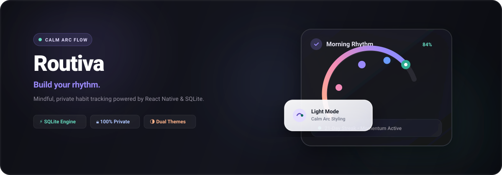

<div align="center">



<br/><br/>

[](https://reactnative.dev/)
[](https://expo.dev/)
[](https://www.sqlite.org/)
[](LICENSE)
[](SECURITY.md)

<br/>

</div>

---

## ✦ Design Philosophy & Vision

**Routiva** redefines personal tracking by shifting away from rigid numbers, aggressive red streaks, and cognitive guilt. Instead, it visualizes consistency through **organic, living arcs of momentum** that reflect natural human cadences.

By combining tactile frosted glassmorphism, soothing lavender accents, and responsive micro-interactions, Routiva creates an atmosphere of quiet accomplishment—turning daily routines into moments of calm reflection.

---

## ✨ Core Pillars

<table>
  <tr>
    <td width="33%" align="center" valign="top">
      <h3>⚡ Zero Friction</h3>
      <p>Instant launch with zero logins, accounts, or mandatory sync. Open the app and log your routine in a single tactile tap.</p>
    </td>
    <td width="33%" align="center" valign="top">
      <h3>🌱 Gentle Cadence</h3>
      <p>Mindful progress visualization that eliminates streak anxiety. Celebrate showing up without fear of breaking momentum.</p>
    </td>
    <td width="33%" align="center" valign="top">
      <h3>🔒 100% Private</h3>
      <p>Built strictly local-first. All records, timestamps, and preferences live securely on your device inside an embedded SQLite database.</p>
    </td>
  </tr>
</table>

---

## 📱 Key Experiences

### 🌌 Initiation & Onboarding
- **Launch Screen**: Subtle organic aura glows, breathing logo badge, and animated micro-dots.
- **Mindful Walkthrough**: Interactive 3-slide introduction featuring the luminous 5-node Milestone Arc.
- **Fast-Track Skip**: Option to jump directly into your daily flow with a single tap.

### 🎯 Daily Tracking & Momentum
- **Rising Arc Indicators**: Dynamic multi-gradient SVG arcs showing completion milestones.
- **Tactile Cards**: Frosted glass containers (`GlassView`) with soft blur and gentle elevation.
- **Customizable Routines**: Tailor icons, color accents, and weekly recurrence patterns.

### 📊 Insights & Consistency
- **Trend Analytics**: Comprehensive completion records and weekly momentum breakdowns.
- **Streak Records**: Personal milestones tracked quietly in the background.

### 🌗 Adaptive Theme Engine
- **Dark Mode**: Deep atmospheric background crafted for nighttime unwinding.
- **Light Mode**: High-clarity lavender-tinted palette for daytime focus.
- **Live Switching**: Seamlessly toggle themes on the fly from Settings.

---

## 🏛️ System Architecture

Routiva is built on a high-velocity reactive stack engineered for zero latency and offline privacy.

- **Client Runtime**: React Native 0.86 with Expo SDK 57
- **Routing Engine**: Expo Router (Modern file-based hierarchy with native stack and tab transitions)
- **Persistence Layer**: Embedded SQLite with Write-Ahead Logging (`WAL`) for sub-millisecond queries
- **Animation Engine**: React Native Reanimated for 60fps fluid transformations and gestures
- **Vector Graphics**: React Native SVG with custom linear gradients and glow filters
- **Visual Depth**: Expo Blur for cross-platform glassmorphic backdrops

📖 *For a deep dive into data models and component architecture, read the [Architecture Guide](ARCHITECTURE.md).*

---

## 🔒 Proprietary License & Copyright

```
Copyright © 2026 Soumya Ranjan Panigrahi (Soumya41509). All Rights Reserved.
```

> **IMPORTANT NOTICE:**  
> This software, including its design systems, animations, source code, and assets, is **PROPRIETARY and CONFIDENTIAL**.  
> **Strictly Not for Copying or Redistribution:** No part of this codebase may be copied, reproduced, distributed, reverse-engineered, sublicensed, or used for derivative works or commercial purposes in any form without prior written authorization from the copyright holder.

- 🛡️ Review our [Security Policy](SECURITY.md) for vulnerability disclosure guidelines.
- 📄 Review the full legal terms in [LICENSE](LICENSE).

For permissions or inquiries: `soumyaranjanpanigrahi111@gmail.com`

<br/>

<div align="center">
  <sub>© 2026 Routiva • Soumya Ranjan Panigrahi. All Rights Reserved.</sub>
</div>
